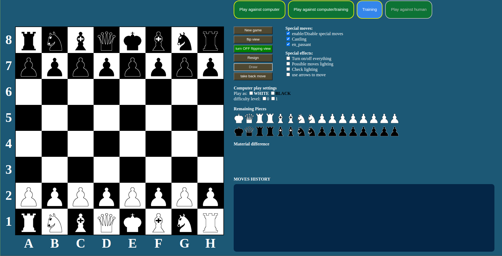

A chess program written in pure JavaScript ( JS, HTML, CSS ).
Currently only level 0 is programmed - totally random moves made by computer
(software random generator). There are still few minor bugs to eliminate.
It doesn't work well (the chessboard rendering) on Firefox now.
 
Future changes and plans:
1) adding higher difficulty levels
2) adding more options
3) adding more visualisations
 

HOW TO PLAY?
 
To play the game you need to download the game directory and open chess.html in your browser
(JS support in browser is required!!!). Firefox/Chrome/Chromium/Opera and most of other
existing browsers should be OK.
1) click on green button "Code" -> "Download ZIP" or download via HTTPS link
2) unzip (if needed)
3) open chess.html (it is in the main directory) in your WEB browser
 

Screenshots:

PROGRAM USAGE:

Game options:
1) chess training ( moving both white and black pieces )
2) play against computer ( with a feature to change color during the game
( training ) and without such an option ( normal game ) ).
 
MENU  
1) "Play against computer" 
Playing against computer without a possibility to switch sides. 
2) "Play against computer/training" 
Playing against computer with a possibility to experiment. 
Switch ( below ) "Play as:" allows to change sides ( the color of pieces ) 
3) "Training" 
Player controls both white and black pieces. 
4) "Play against human" 
Not programmed yet.

 
 
 

CONTROL BUTTONS:
1) "New game" 
Start a new game ( all game modes ). 
2) "flip view" 
switch view ( white/black at the screen bottom ). 
3) "turn OFF/ON flipping view" 
turn on/off auto view switching. 
4) "Resign" 
Resign in the current game ( you need to confirm this choice by clicking "OK" ) 
5) "Draw" 
Not programmed yet ( it will appear alongside adding higher difficulty levels or adding a possiblity to play
with fellows ). 
6) "take back move" 
Take back the last move, works only with training mode.
 
 

Special moves:
1) enable/disable special moves 
Enable/disable all options under this section ( Castling and en_passant )
2) Castling 
Enable/disable castling
3) en_passant 
Enable/disable en_passant move

Special effects:
1) Turn on/off everything 
Enable/disable all options under this section.
2) possible moves lighting 
Showing possible moves for the chosen piece ( blue color ).
3) Check lighting 
Showing check ( king and the checking pieces ). Red color.
4) use arrows to move 
Allow to move pieces by using arrows and ENTER.
